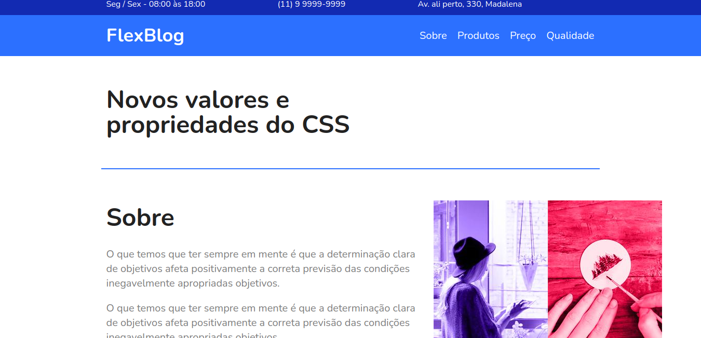

# Flexblog

Projeto final do curso de CSS Flexbox da [Origamid](https://www.origamid.com/)

Aplicação de apenas uma paǵinas feita para testar todas as principais ferramentas que o CSS Flexbox pode proporcionar para os desenvolvedores.

Você pode ver o site melhor por [aqui](https://flexblog-bruna.netlify.app/)

